# AAV QC workflow

Nextflow workflow for AAV vector quality control.


## Introduction

This workflow takes reads sequenced from adeno-associated virus (rAAV) vector preps and 
does some basic quality control checks. The main stages of the workflow are: 


+ Masking of transgene cassette variable ITR regions
+ Mapping reads to a combined reference sequence containing host cell reference genome, mask transgene plasmid and other AAV plasmids
+ Identification of reference which each reads maps to
+ Truncation hotspot identification
+ ITR transgene cassette coverage
+ Determination of AAV genome structure types
+ Calling transgene plasmid variants and creation of consensus 


## Compute requirements

Recommended requirements:

+ CPUs = 8
+ Memory = 32GB

Minimum requirements:

+ CPUs = 4
+ Memory = 16GB

Approximate run time: 15 minutes per sample - 150k reads and 8 cpus

ARM processor support: False


## Install and run


These are instructions to install and run the workflow on command line.
You can also access the workflow via the
[EPI2ME Desktop application](https://labs.epi2me.io/downloads/).

The workflow uses [Nextflow](https://www.nextflow.io/) to manage
compute and software resources,
therefore Nextflow will need to be
installed before attempting to run the workflow.

The workflow can currently be run using either
[Docker](https://www.docker.com/products/docker-desktop)
or [Singularity](https://docs.sylabs.io/guides/3.0/user-guide/index.html)
to provide isolation of the required software.
Both methods are automated out-of-the-box provided
either Docker or Singularity is installed.
This is controlled by the
[`-profile`](https://www.nextflow.io/docs/latest/config.html#config-profiles)
parameter as exemplified below.

It is not required to clone or download the git repository
in order to run the workflow.
More information on running EPI2ME workflows can
be found on our [website](https://labs.epi2me.io/wfindex).

The following command can be used to obtain the workflow.
This will pull the repository in to the assets folder of
Nextflow and provide a list of all parameters
available for the workflow as well as an example command:

```
nextflow run epi2me-labs/wf-aav-qc --help
```
To update a workflow to the latest version on the command line use
the following command:
```
nextflow pull epi2me-labs/wf-aav-qc
```

A demo dataset is provided for testing of the workflow.
It can be downloaded and unpacked using the following commands:
```
wget https://ont-exd-int-s3-euwst1-epi2me-labs.s3.amazonaws.com/wf-aav-qc/wf-aav-qc-demo.tar.gz
tar -xzvf wf-aav-qc-demo.tar.gz
```
The workflow can then be run with the downloaded demo data using:
```
nextflow run epi2me-labs/wf-aav-qc \
	--fastq 'wf-aav-qc-demo/simulated_reads.fq' \
	--itr1_end 156 \
	--itr1_start 11 \
	--itr2_end 2286 \
	--itr2_start 2156 \
	--ref_helper 'wf-aav-qc-demo/helper.fasta' \
	--ref_host 'wf-aav-qc-demo/cell_line.fasta.gz' \
	--ref_rep_cap 'wf-aav-qc-demo/repcap.fasta' \
	--ref_transgene_plasmid 'wf-aav-qc-demo/transgene.fasta' \
	-profile standard
```

For further information about running a workflow on
the command line see https://labs.epi2me.io/wfquickstart/


## Related protocols

This workflow is designed to take input sequences that have been produced from [Oxford Nanopore Technologies](https://nanoporetech.com/) devices using this protocol:

https://community.nanoporetech.com/docs/prepare/library_prep_protocols/ligation-sequencing-gdna-v14-adeno-associated-virus-sequencing/v/aav_9194_v114_reva_20sep2023


## Input example

<!---Example of input directory structure, delete and edit as appropriate per workflow.--->
This workflow accepts either FASTQ or BAM files as input.

The FASTQ or BAM input parameters for this workflow accept one of three cases: (i) the path to a single FASTQ or BAM file; (ii) the path to a top-level directory containing FASTQ or BAM files; (iii) the path to a directory containing one level of sub-directories which in turn contain FASTQ or BAM files. In the first and second cases (i and ii), a sample name can be supplied with `--sample`. In the last case (iii), the data is assumed to be multiplexed with the names of the sub-directories as barcodes. In this case, a sample sheet can be provided with `--sample_sheet`.

```
(i)                     (ii)                 (iii)    
input_reads.fastq   ─── input_directory  ─── input_directory
                        ├── reads0.fastq     ├── barcode01
                        └── reads1.fastq     │   ├── reads0.fastq
                                             │   └── reads1.fastq
                                             ├── barcode02
                                             │   ├── reads0.fastq
                                             │   ├── reads1.fastq
                                             │   └── reads2.fastq
                                             └── barcode03
                                              └── reads0.fastq
```


## Input parameters

### Input Options

| Nextflow parameter name  | Type | Description | Help | Default |
|--------------------------|------|-------------|------|---------|
| fastq | string | FASTQ files to use in the analysis. | This accepts one of three cases: (i) the path to a single FASTQ file; (ii) the path to a top-level directory containing FASTQ files; (iii) the path to a directory containing one level of sub-directories which in turn contain FASTQ files. In the first and second case, a sample name can be supplied with `--sample`. In the last case, the data is assumed to be multiplexed with the names of the sub-directories as barcodes. In this case, a sample sheet can be provided with `--sample_sheet`. |  |
| bam | string | BAM or unaligned BAM (uBAM) files to use in the analysis. | This accepts one of three cases: (i) the path to a single BAM file; (ii) the path to a top-level directory containing BAM files; (iii) the path to a directory containing one level of sub-directories which in turn contain BAM files. In the first and second case, a sample name can be supplied with `--sample`. In the last case, the data is assumed to be multiplexed with the names of the sub-directories as barcodes. In this case, a sample sheet can be provided with `--sample_sheet`. |  |
| analyse_unclassified | boolean | Analyse unclassified reads from input directory. By default the workflow will not process reads in the unclassified directory. | If selected and if the input is a multiplex directory the workflow will also process the unclassified directory. | False |
| transgene_bed | string | A BED file describing transgene plasmid feature locations. | A BED file with columns (1) plasmid_name (eg 'transgene_plasmid'); (2) feature start; (3) feature end; (4) feature name. If used, this file must minimally contain two rows; one for ITR1 and another for ITR2.The feature name must be ITR1 or ITR2 <br> Example row (separated by tabs): ```aav8    11      156     ITR1```  |  |
| itr_fl_threshold | integer | The maximum number of bases missing from an ITR in order for it to be classed as a full length ITR. | For ITR1, this many bases can be missing from the end of the ITR region. For ITR2, this many bases can be missing from the start of the ITR region. | 100 |
| itr_backbone_threshold | integer | The maximum number of bases and alignment is allowed to extended outside of the ITR-ITR region for an associated read to not be classed as `backbone`. | Reads mapping to the transgene plasmid sometimes extend beyond the ITRs. This parameter sets a maximum number or bases after which the read is classified as `backbone`. | 20 |
| itr1_start | integer | The start position of ITR1. |  |  |
| itr1_end | integer | The end position of ITR2. |  |  |
| itr2_start | integer | The start position of ITR2. |  |  |
| itr2_end | integer | The end position of ITR2. |  |  |
| symmetry_threshold | integer | The threshold to consider whether the start or end positions on opposite strands are classed as symmetrical or asymmetrical. | For certain categories of AAV genome type we want to test whether alignments on both strands are symmetrical or asymmetrical (i.e. whether the start and end positions are approximately the same or not) This parameter sets the threshold for this comparison. | 10 |
| ref_host | string | The reference FASTA file for the host organism (.fasta/fasta.gz). |  |  |
| ref_helper | string | The helper plasmid FASTA file. |  |  |
| ref_rep_cap | string | The rep/cap plasmid FASTA file. |  |  |
| non_transgene_refs | string | A path to a folder containing reference sequences for all non-transgene plasmid sequences. |  |  |
| ref_transgene_plasmid | string | The transgene plasmid FASTA file. |  |  |


### Sample Options

| Nextflow parameter name  | Type | Description | Help | Default |
|--------------------------|------|-------------|------|---------|
| sample_sheet | string | A CSV file used to map barcodes to sample aliases. The sample sheet can be provided when the input data is a directory containing sub-directories with FASTQ files. | The sample sheet is a CSV file with, minimally, columns named `barcode` and `alias`. Extra columns are allowed. A `type` column is required for certain workflows and should have the following values; `test_sample`, `positive_control`, `negative_control`, `no_template_control`. |  |
| sample | string | A single sample name for non-multiplexed data. Permissible if passing a single .fastq(.gz) file or directory of .fastq(.gz) files. |  |  |


### Output Options

| Nextflow parameter name  | Type | Description | Help | Default |
|--------------------------|------|-------------|------|---------|
| out_dir | string | Directory for output of all workflow results. |  | output |
| output_genometype_bams | boolean | If true, output a BAM file per identified AAV genome structure type. Otherwise output a BAM file per sample. | Output individual BAM files by the assigned genome type. | False |
| igv | boolean | Enable IGV visualisation in the EPI2ME Desktop Application by creating the required files. |  | False |


### Advanced Options

| Nextflow parameter name  | Type | Description | Help | Default |
|--------------------------|------|-------------|------|---------|
| override_basecaller_cfg | string | Override auto-detected basecaller model that processed the signal data; used to select an appropriate Medaka model. | Per default, the workflow tries to determine the basecall model from the input data. This parameter can be used to override the detected value (or to provide a model name if none was found in the inputs). However, users should only do this if they know for certain which model was used as selecting the wrong option might give sub-optimal results. A list of recent models can be found here: https://github.com/nanoporetech/dorado#DNA-models. |  |


### Miscellaneous Options

| Nextflow parameter name  | Type | Description | Help | Default |
|--------------------------|------|-------------|------|---------|
| threads | integer | Maximum number of CPU threads for a process to consume. Applies to the minimap2 mapping and the AAV structure determination stages. | A minimap2 and AAV structure determination process per sample will be will be run. This setting applies a maximum number of threads to be used for each of these. | 4 |


## Outputs

Output files may be aggregated including information for all samples or provided per sample. Per-sample files will be prefixed with respective aliases and represented below as {{ alias }}.

| Title | File path | Description | Per sample or aggregated |
|-------|-----------|-------------|--------------------------|
| Workflow report | ./wf-aav-qc-report.html | Report for all samples | aggregated |
| Combined reference sequence | ./combined_reference.fa.gz | Reference file containing all AAV plasmid and host genome sequences. | aggregated |
| Combined reference sequence index | ./combined_reference.fa.gz.fai | Index file for combined reference FASTA. | aggregated |
| Compressed combined reference sequence index | ./combined_reference.fa.gz.gzi | Extra index file for combined reference FASTA (required because combined reference is bgzip-compressed). | aggregated |
| Per read alignment info | ./{{ alias }}/{{ alias }}_bam_info.tsv | The result of `seqkit bam`. | per-sample |
| AAV structure assignment | ./{{ alias }}/{{ alias }}_aav_per_read_info.tsv | AAV per read genome subtypes. | per-sample |
| Transgene plasmid consensus | ./{{ alias }}/{{ alias }}_transgene_plasmid_consensus.fasta.gz | The transgene plasmid consensus sequence generated by medaka. | per-sample |
| Transgene plasmid variants | ./{{ alias }}/{{ alias }}_transgene_plasmid_variants.vcf.gz | The transgene plasmid variants file generated by medaka. | per-sample |
| Alignment file | ./{{ alias }}/tagged_bams/sorted.tagged.bam | The resulting tagged BAM file from mapping reads to the combined reference. | per-sample |
| Alignment index file | ./{{ alias }}/tagged_bams/sorted.tagged.bam.bai | The index for the resulting tagged BAM file from mapping reads to the combined reference. | per-sample |
| backbone_contamination alignment | ./{{ alias }}/tagged_bams/backbone_contamination.bam | The resulting tagged BAM file from mapping reads to the combined reference. This file contains alignmnets with the genotype assignment: backbone_contamination | per-sample |
| backbone_contamination alignment index | ./{{ alias }}/tagged_bams/backbone_contamination.bam.bai | The resulting tagged BAM index file from mapping reads to the combined reference. This indexes the file containing alignments with the genotype assignment: backbone_contamination | per-sample |
| full_ssaav alignment | ./{{ alias }}/tagged_bams/full_ssaav.bam | The resulting tagged BAM file from mapping reads to the combined reference. This file contains alignmnets with the genotype assignment: full_ssaav | per-sample |
| full_ssaav alignment index | ./{{ alias }}/tagged_bams/full_ssaav.bam.bai | The resulting tagged BAM index file from mapping reads to the combined reference. This indexes the file containing alignments with the genotype assignment: full_ssaav | per-sample |
| partial_ssaav alignment | ./{{ alias }}/tagged_bams/partial_ssaav.bam | The resulting tagged BAM file from mapping reads to the combined reference. This file contains alignmnets with the genotype assignment: partial_ssaav | per-sample |
| partial_ssaav alignment index | ./{{ alias }}/tagged_bams/partial_ssaav.bam.bai | The resulting tagged BAM index file from mapping reads to the combined reference. This indexes the file containing alignments with the genotype assignment: partial_ssaav | per-sample |
| full_scaav alignment | ./{{ alias }}/tagged_bams/full_scaav.bam | The resulting tagged BAM file from mapping reads to the combined reference. This file contains alignmnets with the genotype assignment: full_scaav | per-sample |
| full_scaav alignment index | ./{{ alias }}/tagged_bams/full_scaav.bam.bai | The resulting tagged BAM index file from mapping reads to the combined reference. This indexes the file containing alignments with the genotype assignment: full_scaav | per-sample |
| itr_region_only alignment | ./{{ alias }}/tagged_bams/itr_region_only.bam | The resulting tagged BAM file from mapping reads to the combined reference. This file contains alignmnets with the genotype assignment: itr_region_only | per-sample |
| itr_region_only alignment index | ./{{ alias }}/tagged_bams/itr_region_only.bam.bai | The resulting tagged BAM index file from mapping reads to the combined reference. This indexes the file containing alignments with the genotype assignment: itr_region_only | per-sample |
| complex alignment | ./{{ alias }}/tagged_bams/complex.bam | The resulting tagged BAM file from mapping reads to the combined reference. This file contains alignmnets with the genotype assignment: complex | per-sample |
| complex alignment index | ./{{ alias }}/tagged_bams/complex.bam.bai | The resulting tagged BAM index file from mapping reads to the combined reference. This indexes the file containing alignments with the genotype assignment: complex | per-sample |
| partial_scaav alignment | ./{{ alias }}/tagged_bams/partial_scaav.bam | The resulting tagged BAM file from mapping reads to the combined reference. This file contains alignmnets with the genotype assignment: partial_scaav | per-sample |
| partial_scaav alignment index | ./{{ alias }}/tagged_bams/partial_scaav.bam.bai | The resulting tagged BAM index file from mapping reads to the combined reference. This indexes the file containing alignments with the genotype assignment: partial_scaav | per-sample |
| unknown alignment | ./{{ alias }}/tagged_bams/unknown.bam | The resulting tagged BAM file from mapping reads to the combined reference. This file contains alignmnets with the genotype assignment: unknown | per-sample |
| unknown alignment index | ./{{ alias }}/tagged_bams/unknown.bam.bai | The resulting tagged BAM index file from mapping reads to the combined reference. This indexes the file containing alignments with the genotype assignment: unknown | per-sample |
| IGV config JSON file | ./igv.json | JSON file with IGV config options to be used by the EPI2ME Desktop Application. | aggregated |


## Pipeline overview

<!---High level numbered list of main steps of the workflow and hyperlink to any tools used. If multiple workflows/different modes perhaps have subheadings and numbered steps. Use nested numbering or bullets where required.--->

The following (Fig.1) is a basic schematic of the workflow:
<figure>

<figcaption>Fig.1 wf-aav-qc workflow</figcaption>
</figure>

### 1: Make a combined reference sequence 
Reads can originate from the transgene cassette, but can also come from the other plasmids
used in the rAAV prep as well as host cell DNA. Therefore, a combined reference is created
that contains the following reference sequences (with relevant parameter):
* transgene plasmid with variable ITR regions masked; see below (`ref_transgene_plasmid`).
* host reference genome (`ref_host`)
* Rep-Cap plasmid (`ref_rep_cap`)
* helper plasmid (`ref_helper`)

An alternative to supplying the non-transgene plasmid sequences individually is to place them into a folder and reference
this folder with the parameter `non_transgene_refs`.


The transgene plasmid ITR cassette will naturally exist in four orientations. 
(termed flip-flip, flip-flop, flop-flop and flop-flip; see Fig.2)
This can lead to incorrect mapping of reads. To address this, the variable regions in the transgene cassette are masked.
This is done by taking the input transgene plasmid and locating the two ITR regions as defined in the `--transgene_annotation`
file. The `C'`, `C`, `B'` and `B` ITR regions are identified for each ITR. From these regions it can be determined which positions are constant between orientations and which are variable, and will be masked.

<figure>
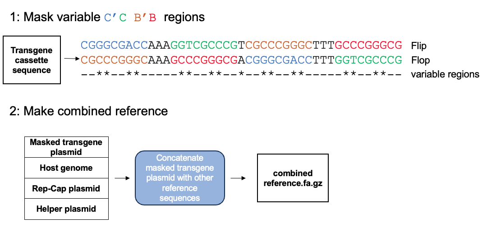
<figcaption>Fig.2 Making a combined reference</figcaption>
</figure>

### 2: Map to reference and get alignment summaries
The reads are mapped to the combined reference using minimap2 (secondary alignments are excluded).
`seqkit bam` is used to generate alignment summaries that are used in the rest of the workflow. 

### 3: Contamination
Reads that do not map to the transgene expression cassette are classified as contaminants. They can arise from
* The Rep-Cap or helper plasmids
* The host expression system
* None of the above reference sequences. The reads will be classified as `Unknown`. If there are a large proportion of reads 
in this category, it may warrant further investigation to identify the source.
<figure>
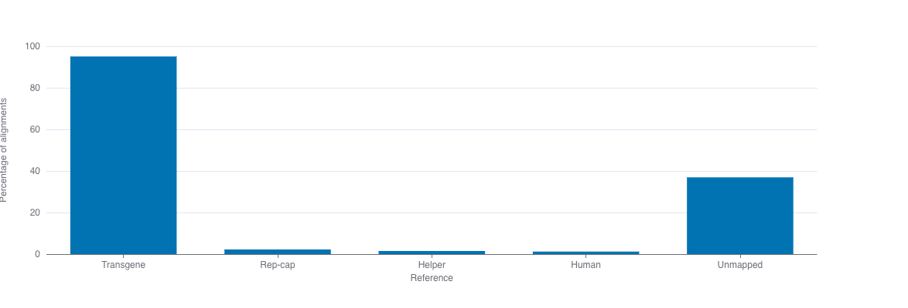
<figcaption>Fig.3 Contamination summary plot </figcaption>
</figure>


### 4: Per-base coverage of the transgene cassette
Depth of coverage is generated for the transgene cassette region using `samtools depth`. 
A plot of this data is shown which indicates whether sufficient coverage has been
achieved across the transgene cassette.
<figure>
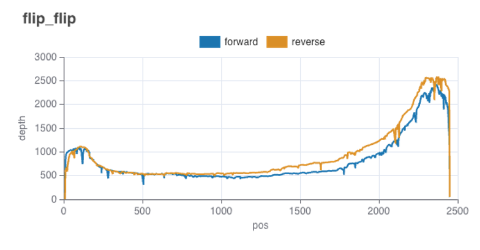
<figcaption>Fig.4 ITR-ITR coverage</figcaption>
</figure>


### 5: Identification of transgene plasmid variants
Transgene plasmid variants are called using [medaka](https://github.com/nanoporetech/medaka), producing a VCF file that is used to generate a consensus sequence using [bcftool concensus](https://samtools.github.io/bcftools/bcftools.html#consensus)
The workflow selects the appropriate Medaka models based on the basecaller configuration that was used to process the signal data.
By default, the workflow will attempt to determine the basecaller model from the input data.
When this fails (or when you wish to override the automatic selection), it can be provided with `--override_basecaller_cfg`.


### 6: Identification of truncated regions
The 'start' and 'end' positions of alignments that map within the transgene cassette are plotted to highlight potential
regions where sequences are becoming truncated.

<figure>

<figcaption>Fig.5 Plot of start and end positions of reads mapping to transgene cassette. </figcaption>
</figure>

### 7: rAAV structure determination
The rAAV transgene expression cassette will ideally exist as full length ITR-flanked regions. 
However, subgenomic particles will be present in any prep, and it can be useful to know the abundance of the various genome
types, which is the aim of this stage of the workflow. Genome types are assigned to each read by applying a series of heuristics that use the characteristics of each alignment from the read. 

There are two user-adjustable parameters relevant to this part of the workflow:
* `--itr_fl_threshold` (default 100). This parameter specifies the maximum number of bases missing from an ITR in order for it to be classed as a full length ITR. 
* `--itr_backbone_threshold` (default 20). Reads mapping to the transgene plasmid sometimes extend beyond the ITRs. This parameter sets a maximum number of bases after which the read is classified as `backbone`.

See the [AAV structures](#aav-structure-diagrams) section for some representative diagrams of AAV gene structures and how they are classified.

At this stage, the BAM alignment files are tagged with `AV:Z` which associates each alignment with an assigned genotype, in the format `AV:Z:full_ssaav`.

If --gtype_bams is set to `true`, these tagged BAMs are split on this tag into separate BAM files.


## Troubleshooting

<!---Any additional tips.--->
+ If the workflow fails please run it with the demo data set to ensure the workflow itself is working. This will help us determine if the issue is related to the environment, input parameters or a bug.
+ See how to interpret some common nextflow exit codes [here](https://labs.epi2me.io/trouble-shooting/).

+ Please ensure that the ITR-ITR cassette region spans and contiguous range in the transgene plasmid reference sequence.
(i.e. ITR1 sequence should precede the ITR2 sequence)


## FAQ's

<!---Frequently asked questions, pose any known limitations as FAQ's.--->

If your question is not answered here, please report any issues or suggestions on the [github issues](https://github.com/epi2me-labs/wf-aav-qc/issues) page or start a discussion on the [community](https://community.nanoporetech.com/). 


## Related blog posts

<!---Any other sections that are relevant specifically to this workflow and may be useful to users eg. ## Related blog posts. ## Learning center links.--->

See the [EPI2ME website](https://labs.epi2me.io/) for lots of other resources and blog posts


## AAV structure definitions

The following diagrams illustrate representative examples of the main genome configurations identifiable by wf-aav-qc.

The definitions are derived from [this publication](https://doi.org/10.1016/j.omtn.2022.08.027) 

To begin with, here are some definitions of terms used in the following section:

**Complete ITR**:
> For a given genome structure, the ITR regions are classed as `complete` if the whole ITR sequence is
covered by an alignment. However, ITR regions are unstable and can often be missing parts of the terminal regions.
When the number of bases missing from an ITR is below a certain size, it may remain functional.
In order to not reject potentially functional partial ITRs, the workflow classes ITRs as `complete` if they are missing
less than `itr_fl_threshold` terminal bases (default 100).

**Partial ITR**:
> ITRs are classed as `partial` if there is alignment support, but the number of bases covered is less than or equal to `ITR length - itr_fl_threshold`.
For example, given an ITR of 145 nt and with the default `itr_fl_threshold` of 100, an ITR would be classed as `partial`
if less than 45 nt was covered.

<figure>
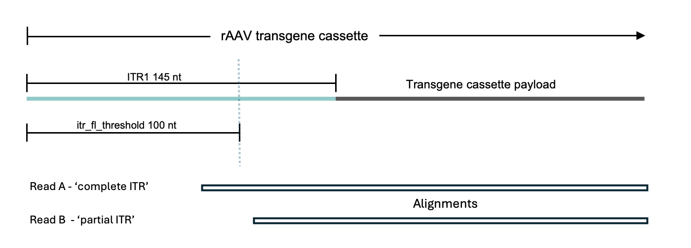
</figure>


**Payload**:
> The genetic material of interest that is to be delivered into cells. In the diagrams below this is indicated by the 
bright and pale orange boxes that represent a promoter and gene of interest.

### 1. Single stranded AAV (ssAAV)
ssAAV is a single-stranded genome flanked by inverted terminal repeat sequences (ITRs).
The workflow classifies these genome types into either full or partial ssAAV.


#### 1.1 Full ssAAV
Contains a single alignment including both `complete` ITRs.

Reads are assigned as originating from a full ssAAV genome if it meets the following criteria:
* There exists a single alignment per read that maps to the transgene plasmid cassette 
* Both ITRs are present and `complete`


<figure>
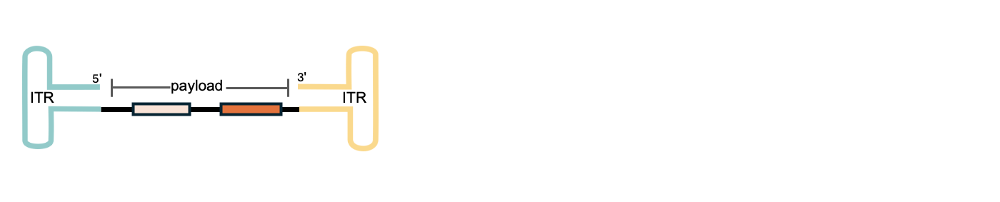
</figure>

#### 1.2 Partial ssAAV
There are several categories of partial ssAAV each defined by which parts of the transgene cassette are absent.

##### 1.2.1 Incomplete genome (ICG)
ICGs are identified as reads that result in a single transgene cassette alignment, 
but one or both ITRs are absent or not `complete`.
They are further categorized by which ITR is present (if any).

<figure>
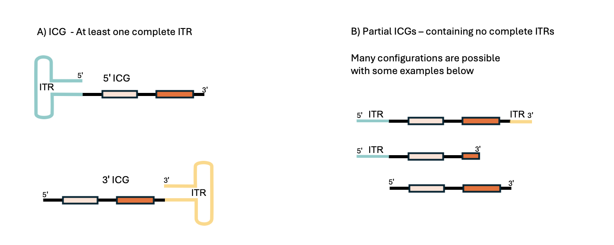
</figure>


##### 1.2.2 Genome deletion mutants (GDM)
This genome type is characterized by the loss of the central part of the genome. 
A read will be assigned a GDM type if it has two alignments to the transgene cassette on the same strand with a gap in between. 
The ITRs may be `complete`, `partial` or absent.

<figure>
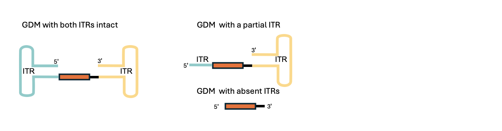
</figure>


### 2 Self-complementary AAV (scAAV)

scAAV genomes are created using a modified ITR sequence that has a mutated terminal resolution site, which results in a 
self-complementary viral genome with an internal ITR and is flanked by terminal ITRs.  

The workflow identifies reads as originating from scAAV genomes if they meet the following criteria:
* Has two alignments to transgene cassette.
* Each alignment maps to opposite strands.


#### 2.1 Full scAAV
Contains a `complete` ITR on both ends of the alignments. Note that the internal ITR will be included in both 
alignments as the ITRs are partially palindromic.  
<figure>
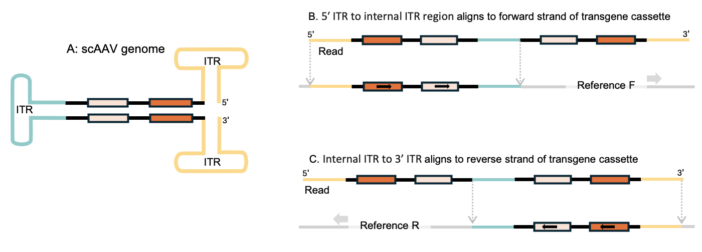
</figure>

Below is a screenshot from IGV showing an example of a read assigned the `full scAAV` type.
<figure>
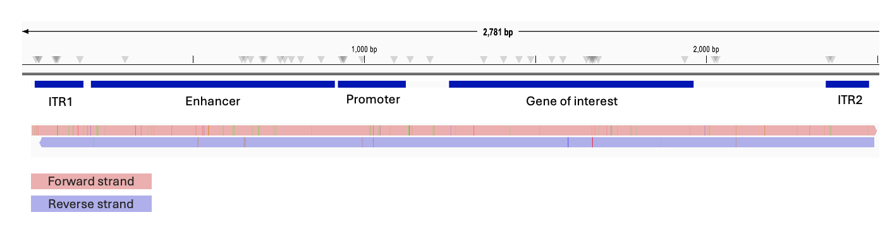
</figure>


#### 2.2 Snapback Genome (SBG)
SBG genomes are a subtype of self-complementary AAV particle that have missing parts of the genome but contain
ITRs on both the 5' and 3' ends. 

They can be further classified as either symmetrical, asymmetrical or unresolved:
* Symmetrical: This is where the same amount of each complementary part of the genome has been deleted.
* Asymmetrical: This is where varying amounts of each complementary part of the genome has been deleted.
If the size of the non-overlapping regions of each alignment is greater than `symmetry_threshold` (default 10),
it is classed as asymmetrical.
<figure>
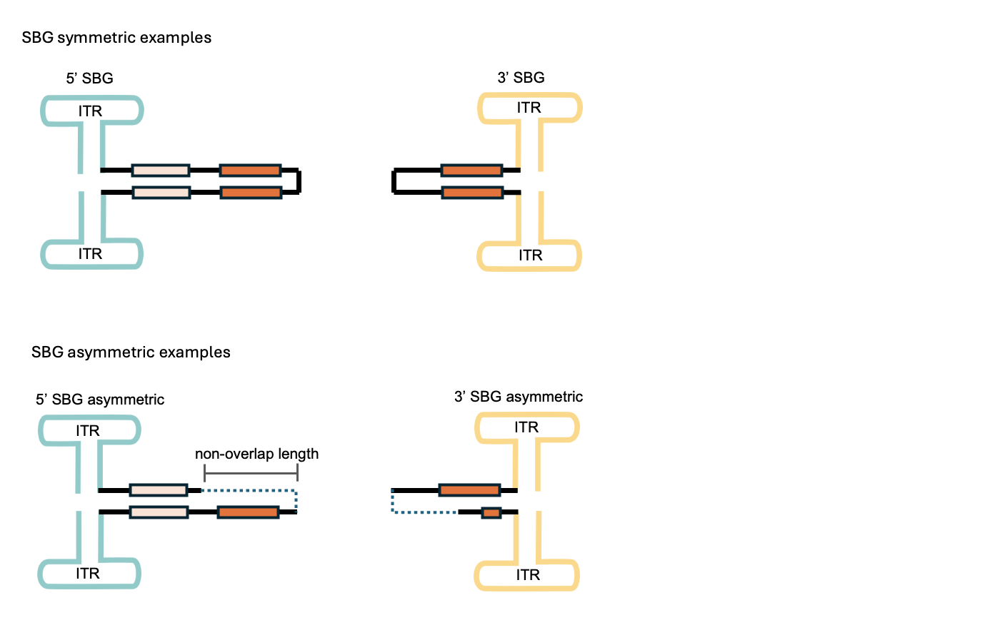
</figure>


#### 2.3 Unresolved SBG
A type of self-complementary AAV characterised by pronounced genome loss of, and asymmetry between, the complementary parts of
the standard genome. Inferring the structure of these AAV genome subtypes can be difficult, so some representative
alignments (a-e) are shown rather than structure diagrams:
<figure>
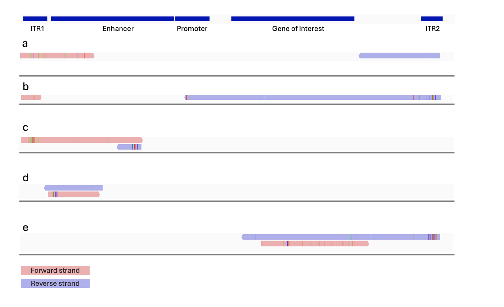
</figure>

### 3 Other 

#### 3.1 ITR region only
These small subgenomic particles contain no payload and can consist of either:
a. Single ITR sequence
b. Two concatenated ITRs. 

<figure>
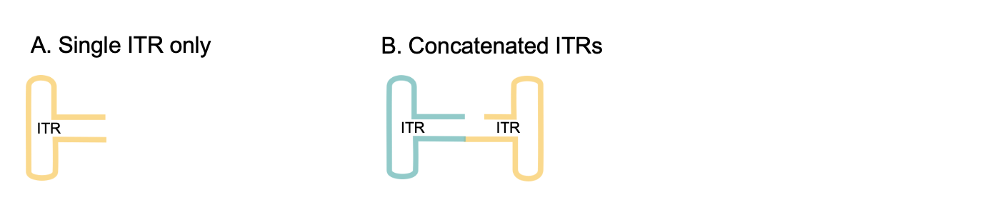
</figure>


#### 3.2 Backbone integration
This genome category contains DNA sequence originating from the plasmid backbone.
The start and/or end positions of the alignment are found outside the ITR-ITR region.
An allowance can be made for some backbone plasmid contamination, and this can be set with the `itr_backbone_threshold` parameter (default 20)

<figure>
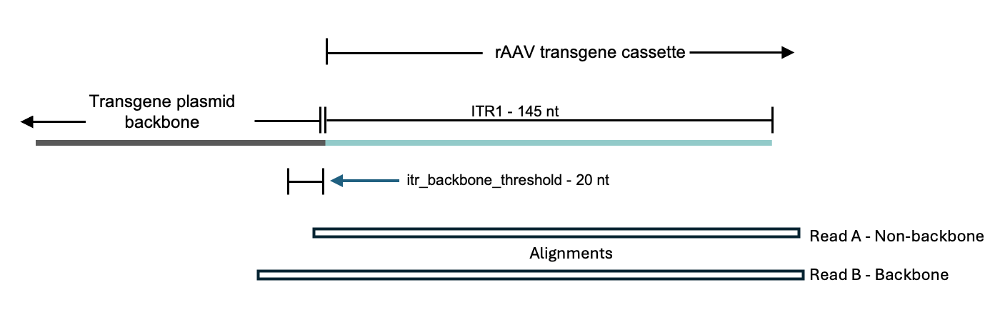
</figure>


#### 3.4 Complex
The complex category contains reads with 3 or more alignments.


